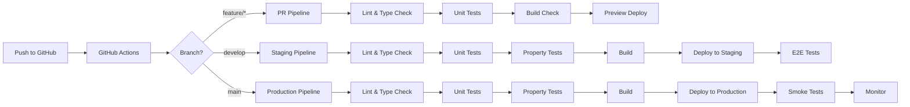
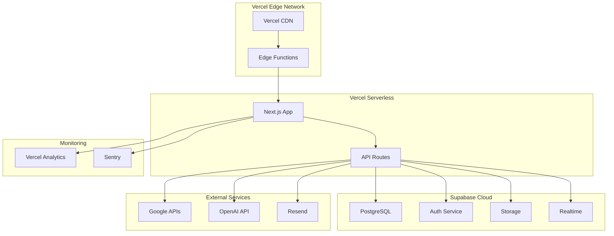

# Design Document - Daily PA

## Overview

Daily PA 是一个现代化的虚拟私人助理 Web 应用，采用全栈 TypeScript 技术栈构建。系统采用前后端分离架构，前端使用 Next.js 14+ (App Router) 配合 React 18，后端使用 Supabase 作为 BaaS（Backend as a Service）平台，提供数据库、身份验证、实时订阅和文件存储等功能。

系统设计遵循响应式设计原则，在桌面端提供完整功能体验，在移动端提供符合 iOS Human Interface Guidelines 的原生化体验。通过 AI 语音助手集成，用户可以通过自然语言快速创建待办事项和记录消费。

### 设计目标

1. **高性能**：首屏加载时间 < 1s，交互响应时间 < 200ms
2. **可扩展**：支持水平扩展，处理大量并发用户
3. **安全性**：端到端加密，符合 GDPR 和数据保护标准
4. **可维护**：模块化设计，清晰的代码组织和文档
5. **用户体验**：流畅的动画，直观的交互，iOS 风格的移动端体验

## Architecture

### 系统架构图


```mermaid
graph TB
    subgraph "Client Layer"
        A[Next.js 14 App]
        A1[Desktop UI]
        A2[Mobile UI - iOS Style]
        A3[PWA Support]
    end
    
    subgraph "API Layer"
        B[Next.js API Routes]
        B1[/api/todos]
        B2[/api/expenses]
        B3[/api/reports]
        B4[/api/voice]
    end
    
    subgraph "Backend Services - Supabase"
        C[Supabase]
        C1[PostgreSQL Database]
        C2[Auth Service]
        C3[Storage Service]
        C4[Realtime Service]
    end
    
    subgraph "External Services"
        D1[Google Calendar API]
        D2[OpenAI Whisper API]
        D3[Resend Email Service]
        D4[Vercel Blob Storage]
    end
    
    A --> B
    A1 --> A
    A2 --> A
    A3 --> A
    B --> B1
    B --> B2
    B --> B3
    B --> B4
    B --> C
    C --> C1
    C --> C2
    C --> C3
    C --> C4
    B --> D1
    B --> D2
    B --> D3
    B --> D4
```

### 技术栈选择


**前端技术栈：**
- **框架**: Next.js 14+ (App Router) - 提供 SSR、SSG、ISR 支持，优化 SEO 和性能
- **UI 库**: React 18 - 使用 Server Components 和 Suspense 优化性能
- **样式**: Tailwind CSS 3.4+ - 快速构建响应式界面
- **组件库**: Shadcn/ui - 基于 Radix UI 的可定制组件
- **状态管理**: Zustand - 轻量级状态管理
- **表单处理**: React Hook Form + Zod - 类型安全的表单验证
- **数据获取**: TanStack Query (React Query) - 服务端状态管理和缓存
- **动画**: Framer Motion - 流畅的动画效果
- **图表**: Recharts - 数据可视化

**后端技术栈：**
- **BaaS 平台**: Supabase - 提供数据库、认证、存储、实时功能
- **数据库**: PostgreSQL (Supabase) - 关系型数据库
- **ORM**: Supabase Client SDK - 类型安全的数据库查询
- **API**: Next.js API Routes - 服务端 API 端点
- **认证**: Supabase Auth + NextAuth.js - 多种认证方式支持

**第三方服务：**
- **身份验证**: Supabase Auth (Email/Phone) + Google OAuth
- **文件存储**: Supabase Storage (收据图片) + Vercel Blob (备份)
- **邮件服务**: Resend - 事务性邮件和通知
- **日历集成**: Google Calendar API - 日历同步
- **语音识别**: OpenAI Whisper API - 语音转文字
- **AI 处理**: OpenAI GPT-4 - 自然语言理解和任务解析

**开发工具：**
- **语言**: TypeScript 5.3+ - 类型安全
- **代码质量**: ESLint + Prettier - 代码规范
- **测试**: Vitest + React Testing Library - 单元测试和集成测试
- **E2E 测试**: Playwright - 端到端测试
- **CI/CD**: GitHub Actions - 自动化部署流程
- **部署**: Vercel - 前端和 API 部署
- **监控**: Vercel Analytics + Sentry - 性能监控和错误追踪

### 架构模式


**1. 前后端分离架构**
- 前端：Next.js 应用负责 UI 渲染和用户交互
- 后端：Supabase 提供数据持久化和业务逻辑
- API 层：Next.js API Routes 作为中间层处理复杂业务逻辑

**2. 服务端渲染 (SSR) + 客户端渲染 (CSR) 混合模式**
- 公开页面（登录、注册）使用 SSR 优化 SEO
- 应用内页面使用 CSR 提供动态交互
- 使用 React Server Components 优化初始加载

**3. 微服务化的 API 设计**
- 每个功能模块独立的 API 端点
- RESTful API 设计原则
- 统一的错误处理和响应格式

**4. 实时数据同步**
- 使用 Supabase Realtime 实现跨设备数据同步
- WebSocket 连接保持数据一致性
- 离线优先策略，本地缓存 + 后台同步

**5. 渐进式 Web 应用 (PWA)**
- Service Worker 支持离线访问
- 应用缓存策略优化性能
- 支持添加到主屏幕

## Components and Interfaces

### 前端组件架构


```
src/
├── app/                          # Next.js App Router
│   ├── (auth)/                   # 认证相关页面组
│   │   ├── login/
│   │   ├── register/
│   │   └── reset-password/
│   ├── (dashboard)/              # 主应用页面组
│   │   ├── todos/
│   │   ├── calendar/
│   │   ├── expenses/
│   │   ├── reports/
│   │   └── profile/
│   ├── api/                      # API Routes
│   │   ├── auth/
│   │   ├── todos/
│   │   ├── expenses/
│   │   ├── calendar/
│   │   ├── voice/
│   │   └── reports/
│   ├── layout.tsx                # 根布局
│   └── page.tsx                  # 首页
├── components/                   # React 组件
│   ├── ui/                       # Shadcn/ui 基础组件
│   ├── layout/                   # 布局组件
│   │   ├── Header.tsx
│   │   ├── Sidebar.tsx
│   │   ├── MobileNav.tsx
│   │   └── Footer.tsx
│   ├── todos/                    # 待办事项组件
│   │   ├── TodoList.tsx
│   │   ├── TodoItem.tsx
│   │   ├── TodoForm.tsx
│   │   └── TodoFilters.tsx
│   ├── calendar/                 # 日历组件
│   │   ├── CalendarView.tsx
│   │   ├── EventCard.tsx
│   │   └── CalendarSync.tsx
│   ├── expenses/                 # 消费记录组件
│   │   ├── ExpenseList.tsx
│   │   ├── ExpenseForm.tsx
│   │   ├── ExpenseChart.tsx
│   │   └── CategoryPicker.tsx
│   ├── voice/                    # 语音助手组件
│   │   ├── VoiceButton.tsx
│   │   ├── VoiceRecorder.tsx
│   │   └── TranscriptDisplay.tsx
│   └── reports/                  # 报告组件
│       ├── MonthlyReport.tsx
│       ├── ReportChart.tsx
│       └── ReportExport.tsx
├── lib/                          # 工具库
│   ├── supabase/                 # Supabase 客户端
│   │   ├── client.ts
│   │   ├── server.ts
│   │   └── middleware.ts
│   ├── api/                      # API 客户端
│   │   ├── todos.ts
│   │   ├── expenses.ts
│   │   └── calendar.ts
│   ├── hooks/                    # 自定义 Hooks
│   │   ├── useTodos.ts
│   │   ├── useExpenses.ts
│   │   ├── useVoice.ts
│   │   └── useAuth.ts
│   ├── utils/                    # 工具函数
│   │   ├── date.ts
│   │   ├── format.ts
│   │   └── validation.ts
│   └── stores/                   # Zustand 状态管理
│       ├── authStore.ts
│       ├── todoStore.ts
│       └── uiStore.ts
├── types/                        # TypeScript 类型定义
│   ├── database.types.ts         # Supabase 生成的类型
│   ├── todo.ts
│   ├── expense.ts
│   └── user.ts
└── styles/                       # 全局样式
    └── globals.css
```

### 核心组件接口


**1. TodoList 组件**

```typescript
interface TodoListProps {
  filter?: 'all' | 'active' | 'completed';
  sortBy?: 'date' | 'priority' | 'title';
  onTodoClick?: (todo: Todo) => void;
}

interface Todo {
  id: string;
  userId: string;
  title: string;
  description?: string;
  dueDate?: Date;
  priority: 'low' | 'medium' | 'high';
  status: 'active' | 'completed';
  tags: string[];
  createdAt: Date;
  updatedAt: Date;
}
```

**2. ExpenseForm 组件**

```typescript
interface ExpenseFormProps {
  initialData?: Expense;
  onSubmit: (data: ExpenseInput) => Promise<void>;
  onCancel?: () => void;
}

interface Expense {
  id: string;
  userId: string;
  amount: number;
  currency: string;
  category: ExpenseCategory;
  description: string;
  date: Date;
  receiptUrl?: string;
  tags: string[];
  createdAt: Date;
}

type ExpenseCategory = 
  | 'food' | 'transport' | 'shopping' 
  | 'entertainment' | 'bills' | 'health' 
  | 'education' | 'other';
```

**3. VoiceRecorder 组件**

```typescript
interface VoiceRecorderProps {
  onTranscript: (transcript: string, intent: VoiceIntent) => void;
  onError?: (error: Error) => void;
}

interface VoiceIntent {
  type: 'todo' | 'expense' | 'query';
  data: TodoInput | ExpenseInput | null;
  confidence: number;
}
```

**4. CalendarView 组件**

```typescript
interface CalendarViewProps {
  view: 'month' | 'week' | 'day';
  events: CalendarEvent[];
  onEventClick?: (event: CalendarEvent) => void;
  onDateSelect?: (date: Date) => void;
}

interface CalendarEvent {
  id: string;
  title: string;
  start: Date;
  end: Date;
  allDay: boolean;
  source: 'todo' | 'google' | 'manual';
  color?: string;
}
```

### API 接口设计


**RESTful API 端点**

```
# 认证 API
POST   /api/auth/register          # 用户注册
POST   /api/auth/login             # 用户登录
POST   /api/auth/logout            # 用户登出
POST   /api/auth/reset-password    # 重置密码
GET    /api/auth/me                # 获取当前用户信息

# 待办事项 API
GET    /api/todos                  # 获取待办列表
POST   /api/todos                  # 创建待办
GET    /api/todos/:id              # 获取单个待办
PUT    /api/todos/:id              # 更新待办
DELETE /api/todos/:id              # 删除待办
PATCH  /api/todos/:id/status       # 更新待办状态

# 消费记录 API
GET    /api/expenses               # 获取消费列表
POST   /api/expenses               # 创建消费记录
GET    /api/expenses/:id           # 获取单个消费记录
PUT    /api/expenses/:id           # 更新消费记录
DELETE /api/expenses/:id           # 删除消费记录
GET    /api/expenses/summary       # 获取消费汇总

# 日历 API
GET    /api/calendar/events        # 获取日历事件
POST   /api/calendar/sync          # 同步 Google 日历
GET    /api/calendar/google/auth   # Google OAuth 授权
POST   /api/calendar/google/callback # Google OAuth 回调

# 语音助手 API
POST   /api/voice/transcribe       # 语音转文字
POST   /api/voice/parse            # 解析语音意图

# 报告 API
GET    /api/reports/monthly        # 获取月度报告
GET    /api/reports/custom         # 获取自定义报告
POST   /api/reports/export         # 导出报告

# 通知 API
GET    /api/notifications          # 获取通知列表
PUT    /api/notifications/settings # 更新通知设置
```

**API 响应格式**

```typescript
// 成功响应
interface ApiResponse<T> {
  success: true;
  data: T;
  meta?: {
    page?: number;
    limit?: number;
    total?: number;
  };
}

// 错误响应
interface ApiError {
  success: false;
  error: {
    code: string;
    message: string;
    details?: Record<string, string[]>;
  };
}
```

## Data Models

### 数据库 Schema (PostgreSQL/Supabase)


```sql
-- 用户表
CREATE TABLE users (
  id UUID PRIMARY KEY DEFAULT gen_random_uuid(),
  email VARCHAR(255) UNIQUE,
  phone VARCHAR(20) UNIQUE,
  password_hash VARCHAR(255),
  full_name VARCHAR(100),
  avatar_url TEXT,
  google_id VARCHAR(255),
  email_verified BOOLEAN DEFAULT FALSE,
  phone_verified BOOLEAN DEFAULT FALSE,
  role VARCHAR(20) DEFAULT 'user',
  preferences JSONB DEFAULT '{}',
  created_at TIMESTAMPTZ DEFAULT NOW(),
  updated_at TIMESTAMPTZ DEFAULT NOW()
);

-- 待办事项表
CREATE TABLE todos (
  id UUID PRIMARY KEY DEFAULT gen_random_uuid(),
  user_id UUID REFERENCES users(id) ON DELETE CASCADE,
  title VARCHAR(255) NOT NULL,
  description TEXT,
  due_date TIMESTAMPTZ,
  priority VARCHAR(10) DEFAULT 'medium',
  status VARCHAR(20) DEFAULT 'active',
  tags TEXT[] DEFAULT '{}',
  calendar_event_id UUID,
  google_event_id VARCHAR(255),
  created_at TIMESTAMPTZ DEFAULT NOW(),
  updated_at TIMESTAMPTZ DEFAULT NOW()
);

-- 消费记录表
CREATE TABLE expenses (
  id UUID PRIMARY KEY DEFAULT gen_random_uuid(),
  user_id UUID REFERENCES users(id) ON DELETE CASCADE,
  amount DECIMAL(12, 2) NOT NULL,
  currency VARCHAR(3) DEFAULT 'CNY',
  category VARCHAR(50) NOT NULL,
  description TEXT,
  expense_date DATE NOT NULL,
  receipt_url TEXT,
  tags TEXT[] DEFAULT '{}',
  created_at TIMESTAMPTZ DEFAULT NOW(),
  updated_at TIMESTAMPTZ DEFAULT NOW()
);

-- 日历事件表
CREATE TABLE calendar_events (
  id UUID PRIMARY KEY DEFAULT gen_random_uuid(),
  user_id UUID REFERENCES users(id) ON DELETE CASCADE,
  title VARCHAR(255) NOT NULL,
  description TEXT,
  start_time TIMESTAMPTZ NOT NULL,
  end_time TIMESTAMPTZ NOT NULL,
  all_day BOOLEAN DEFAULT FALSE,
  source VARCHAR(20) DEFAULT 'manual',
  google_event_id VARCHAR(255),
  todo_id UUID REFERENCES todos(id) ON DELETE SET NULL,
  color VARCHAR(7),
  created_at TIMESTAMPTZ DEFAULT NOW(),
  updated_at TIMESTAMPTZ DEFAULT NOW()
);

-- 月度报告表
CREATE TABLE monthly_reports (
  id UUID PRIMARY KEY DEFAULT gen_random_uuid(),
  user_id UUID REFERENCES users(id) ON DELETE CASCADE,
  year INTEGER NOT NULL,
  month INTEGER NOT NULL,
  report_data JSONB NOT NULL,
  generated_at TIMESTAMPTZ DEFAULT NOW(),
  UNIQUE(user_id, year, month)
);

-- 通知设置表
CREATE TABLE notification_settings (
  id UUID PRIMARY KEY DEFAULT gen_random_uuid(),
  user_id UUID REFERENCES users(id) ON DELETE CASCADE UNIQUE,
  email_enabled BOOLEAN DEFAULT TRUE,
  push_enabled BOOLEAN DEFAULT TRUE,
  daily_summary BOOLEAN DEFAULT FALSE,
  weekly_summary BOOLEAN DEFAULT TRUE,
  reminder_before_minutes INTEGER DEFAULT 30,
  created_at TIMESTAMPTZ DEFAULT NOW(),
  updated_at TIMESTAMPTZ DEFAULT NOW()
);

-- Google 日历连接表
CREATE TABLE google_calendar_connections (
  id UUID PRIMARY KEY DEFAULT gen_random_uuid(),
  user_id UUID REFERENCES users(id) ON DELETE CASCADE UNIQUE,
  access_token TEXT NOT NULL,
  refresh_token TEXT NOT NULL,
  token_expires_at TIMESTAMPTZ NOT NULL,
  calendar_id VARCHAR(255),
  last_sync_at TIMESTAMPTZ,
  created_at TIMESTAMPTZ DEFAULT NOW()
);

-- 索引
CREATE INDEX idx_todos_user_id ON todos(user_id);
CREATE INDEX idx_todos_status ON todos(status);
CREATE INDEX idx_todos_due_date ON todos(due_date);
CREATE INDEX idx_expenses_user_id ON expenses(user_id);
CREATE INDEX idx_expenses_date ON expenses(expense_date);
CREATE INDEX idx_expenses_category ON expenses(category);
CREATE INDEX idx_calendar_events_user_id ON calendar_events(user_id);
CREATE INDEX idx_calendar_events_start_time ON calendar_events(start_time);
```

### TypeScript 类型定义


```typescript
// types/user.ts
export interface User {
  id: string;
  email: string | null;
  phone: string | null;
  fullName: string | null;
  avatarUrl: string | null;
  googleId: string | null;
  emailVerified: boolean;
  phoneVerified: boolean;
  role: 'user' | 'admin';
  preferences: UserPreferences;
  createdAt: Date;
  updatedAt: Date;
}

export interface UserPreferences {
  theme: 'light' | 'dark' | 'system';
  language: 'zh-CN' | 'en-US';
  currency: string;
  timezone: string;
}

// types/todo.ts
export interface Todo {
  id: string;
  userId: string;
  title: string;
  description: string | null;
  dueDate: Date | null;
  priority: 'low' | 'medium' | 'high';
  status: 'active' | 'completed';
  tags: string[];
  calendarEventId: string | null;
  googleEventId: string | null;
  createdAt: Date;
  updatedAt: Date;
}

export interface TodoInput {
  title: string;
  description?: string;
  dueDate?: Date;
  priority?: 'low' | 'medium' | 'high';
  tags?: string[];
}

// types/expense.ts
export interface Expense {
  id: string;
  userId: string;
  amount: number;
  currency: string;
  category: ExpenseCategory;
  description: string | null;
  expenseDate: Date;
  receiptUrl: string | null;
  tags: string[];
  createdAt: Date;
  updatedAt: Date;
}

export type ExpenseCategory = 
  | 'food' 
  | 'transport' 
  | 'shopping' 
  | 'entertainment' 
  | 'bills' 
  | 'health' 
  | 'education' 
  | 'other';

export interface ExpenseInput {
  amount: number;
  currency?: string;
  category: ExpenseCategory;
  description?: string;
  expenseDate: Date;
  receiptUrl?: string;
  tags?: string[];
}

// types/calendar.ts
export interface CalendarEvent {
  id: string;
  userId: string;
  title: string;
  description: string | null;
  startTime: Date;
  endTime: Date;
  allDay: boolean;
  source: 'manual' | 'todo' | 'google';
  googleEventId: string | null;
  todoId: string | null;
  color: string | null;
  createdAt: Date;
  updatedAt: Date;
}

// types/report.ts
export interface MonthlyReport {
  id: string;
  userId: string;
  year: number;
  month: number;
  reportData: ReportData;
  generatedAt: Date;
}

export interface ReportData {
  todos: {
    total: number;
    completed: number;
    completionRate: number;
    byPriority: Record<string, number>;
  };
  expenses: {
    total: number;
    byCategory: Record<ExpenseCategory, number>;
    dailyAverage: number;
    topCategories: Array<{ category: string; amount: number }>;
  };
  insights: string[];
}
```

## Correctness Properties


*A property is a characteristic or behavior that should hold true across all valid executions of a system—essentially, a formal statement about what the system should do. Properties serve as the bridge between human-readable specifications and machine-verifiable correctness guarantees.*

### Property 1: 用户注册数据持久化

*For any* valid email/password or phone/password combination, when a user registers, the user account should be created and retrievable from the database with the same email/phone.

**Validates: Requirements 1.1, 1.2**

### Property 2: 认证凭证验证

*For any* registered user with valid credentials, authentication should succeed and return a valid session. *For any* invalid credentials, authentication should fail with an error.

**Validates: Requirements 1.4, 1.7**

### Property 3: 待办事项 CRUD 往返一致性

*For any* valid todo input, creating a todo and then retrieving it should return an equivalent todo object. *For any* todo and valid edit, updating and then retrieving should return the updated values.

**Validates: Requirements 2.1, 2.3**

### Property 4: 待办事项状态转换

*For any* active todo, marking it as complete should change its status to 'completed'. The status change should be idempotent (marking complete twice has the same effect as once).

**Validates: Requirements 2.2**

### Property 5: 待办事项删除

*For any* todo in the list, after deletion, the todo should no longer be retrievable and the list length should decrease by one.

**Validates: Requirements 2.4**

### Property 6: 待办事项与日历事件同步

*For any* todo created with a due date, a corresponding calendar event should exist with matching title and date. Updating the todo's due date should update the calendar event.

**Validates: Requirements 2.5, 3.1**

### Property 7: 待办事项优先级排序

*For any* list of todos with different priorities, sorting by priority should return todos in order: high > medium > low.

**Validates: Requirements 2.6**

### Property 8: 待办事项标签过滤

*For any* set of todos with tags, filtering by a specific tag should return exactly those todos that contain that tag.

**Validates: Requirements 2.7**

### Property 9: 消费记录 CRUD 往返一致性

*For any* valid expense input, creating an expense and then retrieving it should return an equivalent expense object with the same amount, category, and date.

**Validates: Requirements 4.1, 4.4**

### Property 10: 消费记录时间排序

*For any* set of expenses, viewing them should return expenses sorted by date in descending order (newest first).

**Validates: Requirements 4.2**

### Property 11: 消费记录删除

*For any* expense in the list, after deletion, the expense should no longer be retrievable.

**Validates: Requirements 4.5**

### Property 12: 消费记录收据附件

*For any* expense with an attached receipt URL, the receipt URL should be stored and retrievable with the expense record.

**Validates: Requirements 4.6**

### Property 13: 消费汇总聚合正确性

*For any* set of expenses, the summary by category should equal the sum of all expenses in each category. The total should equal the sum of all category totals.

**Validates: Requirements 4.7, 6.3**

### Property 14: 语音输入解析 - 待办事项

*For any* voice transcript containing a clear todo description, the AI parser should extract and create a todo with the correct title. If the transcript contains a date/time, the due date should be set accordingly.

**Validates: Requirements 5.2, 5.4**

### Property 15: 语音输入解析 - 消费记录

*For any* voice transcript containing an amount and description, the AI parser should extract and create an expense with the correct amount and category.

**Validates: Requirements 5.3**

### Property 16: 报告数据完整性

*For any* date range, the generated report should include only data from that range. The todo completion count should match the actual completed todos in that period.

**Validates: Requirements 6.2, 6.6**

### Property 17: 分享链接往返一致性

*For any* shared todo list, generating a share link and then accessing it should display the same content as the original list.

**Validates: Requirements 7.3, 7.5**

### Property 18: 用户偏好设置持久化

*For any* user preference change (theme, language, notifications), the change should be persisted and applied across all sessions.

**Validates: Requirements 7.6, 9.2, 9.3, 9.6**

### Property 19: 用户数据级联删除

*For any* user account deletion, all associated data (todos, expenses, calendar events, reports) should be deleted. No orphaned records should remain.

**Validates: Requirements 9.7**

### Property 20: 跨设备数据一致性

*For any* user accessing the application from multiple devices, the data should be consistent across all sessions after sync completes.

**Validates: Requirements 11.1, 11.2**

## Error Handling


### 错误处理策略

**1. 前端错误处理**

```typescript
// 全局错误边界
class ErrorBoundary extends React.Component {
  state = { hasError: false, error: null };
  
  static getDerivedStateFromError(error: Error) {
    return { hasError: true, error };
  }
  
  componentDidCatch(error: Error, errorInfo: React.ErrorInfo) {
    // 上报错误到 Sentry
    Sentry.captureException(error, { extra: errorInfo });
  }
}

// API 错误处理
const handleApiError = (error: ApiError) => {
  switch (error.code) {
    case 'UNAUTHORIZED':
      // 重定向到登录页
      router.push('/login');
      break;
    case 'VALIDATION_ERROR':
      // 显示表单验证错误
      toast.error(error.message);
      break;
    case 'NETWORK_ERROR':
      // 显示网络错误提示
      toast.error('网络连接失败，请检查网络');
      break;
    default:
      toast.error('操作失败，请稍后重试');
  }
};
```

**2. 后端错误处理**

```typescript
// 统一错误响应格式
class AppError extends Error {
  constructor(
    public code: string,
    public message: string,
    public statusCode: number = 400,
    public details?: Record<string, string[]>
  ) {
    super(message);
  }
}

// 错误类型
const ErrorCodes = {
  VALIDATION_ERROR: 'VALIDATION_ERROR',
  UNAUTHORIZED: 'UNAUTHORIZED',
  FORBIDDEN: 'FORBIDDEN',
  NOT_FOUND: 'NOT_FOUND',
  CONFLICT: 'CONFLICT',
  RATE_LIMITED: 'RATE_LIMITED',
  INTERNAL_ERROR: 'INTERNAL_ERROR',
} as const;

// API 路由错误处理中间件
const errorHandler = (error: Error, req: Request, res: Response) => {
  if (error instanceof AppError) {
    return res.status(error.statusCode).json({
      success: false,
      error: {
        code: error.code,
        message: error.message,
        details: error.details,
      },
    });
  }
  
  // 未知错误
  console.error(error);
  Sentry.captureException(error);
  
  return res.status(500).json({
    success: false,
    error: {
      code: 'INTERNAL_ERROR',
      message: '服务器内部错误',
    },
  });
};
```

**3. 数据验证**

```typescript
// 使用 Zod 进行输入验证
import { z } from 'zod';

const todoInputSchema = z.object({
  title: z.string().min(1, '标题不能为空').max(255, '标题过长'),
  description: z.string().max(1000).optional(),
  dueDate: z.date().optional(),
  priority: z.enum(['low', 'medium', 'high']).default('medium'),
  tags: z.array(z.string()).default([]),
});

const expenseInputSchema = z.object({
  amount: z.number().positive('金额必须大于0'),
  currency: z.string().length(3).default('CNY'),
  category: z.enum(['food', 'transport', 'shopping', 'entertainment', 'bills', 'health', 'education', 'other']),
  description: z.string().max(500).optional(),
  expenseDate: z.date(),
  tags: z.array(z.string()).default([]),
});
```

**4. 离线错误处理**

```typescript
// 离线队列管理
class OfflineQueue {
  private queue: PendingOperation[] = [];
  
  async add(operation: PendingOperation) {
    this.queue.push(operation);
    await this.persist();
  }
  
  async sync() {
    if (!navigator.onLine) return;
    
    for (const op of this.queue) {
      try {
        await this.execute(op);
        await this.remove(op.id);
      } catch (error) {
        if (error.code === 'CONFLICT') {
          // 处理冲突
          await this.resolveConflict(op);
        }
      }
    }
  }
}
```

## Testing Strategy


### 测试框架选择

- **单元测试**: Vitest - 快速、兼容 Jest API
- **组件测试**: React Testing Library - 测试用户交互
- **属性测试**: fast-check - TypeScript 属性测试库
- **E2E 测试**: Playwright - 跨浏览器端到端测试
- **API 测试**: Supertest - HTTP 断言库

### 测试策略

**1. 单元测试**
- 覆盖所有工具函数和业务逻辑
- 测试边界条件和错误处理
- 目标覆盖率: 80%+

**2. 属性测试 (Property-Based Testing)**
- 使用 fast-check 库
- 每个属性测试运行 100+ 次迭代
- 测试数据生成器覆盖边界情况

```typescript
import * as fc from 'fast-check';
import { describe, it, expect } from 'vitest';

// Property 3: 待办事项 CRUD 往返一致性
// Feature: daily-pa, Property 3: Todo CRUD round-trip consistency
describe('Todo CRUD Properties', () => {
  it('should persist and retrieve todo with same values', () => {
    fc.assert(
      fc.asyncProperty(
        fc.record({
          title: fc.string({ minLength: 1, maxLength: 255 }),
          description: fc.option(fc.string({ maxLength: 1000 })),
          priority: fc.constantFrom('low', 'medium', 'high'),
          tags: fc.array(fc.string(), { maxLength: 5 }),
        }),
        async (todoInput) => {
          const created = await createTodo(todoInput);
          const retrieved = await getTodo(created.id);
          
          expect(retrieved.title).toBe(todoInput.title);
          expect(retrieved.priority).toBe(todoInput.priority);
          return true;
        }
      ),
      { numRuns: 100 }
    );
  });
});

// Property 7: 待办事项优先级排序
// Feature: daily-pa, Property 7: Todo priority sorting
describe('Todo Sorting Properties', () => {
  it('should sort todos by priority correctly', () => {
    fc.assert(
      fc.property(
        fc.array(
          fc.record({
            id: fc.uuid(),
            title: fc.string(),
            priority: fc.constantFrom('low', 'medium', 'high'),
          }),
          { minLength: 1, maxLength: 100 }
        ),
        (todos) => {
          const sorted = sortByPriority(todos);
          const priorityOrder = { high: 0, medium: 1, low: 2 };
          
          for (let i = 1; i < sorted.length; i++) {
            const prevPriority = priorityOrder[sorted[i - 1].priority];
            const currPriority = priorityOrder[sorted[i].priority];
            expect(prevPriority).toBeLessThanOrEqual(currPriority);
          }
          return true;
        }
      ),
      { numRuns: 100 }
    );
  });
});

// Property 13: 消费汇总聚合正确性
// Feature: daily-pa, Property 13: Expense aggregation correctness
describe('Expense Aggregation Properties', () => {
  it('should correctly aggregate expenses by category', () => {
    fc.assert(
      fc.property(
        fc.array(
          fc.record({
            amount: fc.float({ min: 0.01, max: 10000 }),
            category: fc.constantFrom('food', 'transport', 'shopping', 'entertainment', 'bills', 'health', 'education', 'other'),
          }),
          { maxLength: 100 }
        ),
        (expenses) => {
          const summary = aggregateByCategory(expenses);
          
          // 验证每个类别的总和
          for (const category of Object.keys(summary)) {
            const expected = expenses
              .filter(e => e.category === category)
              .reduce((sum, e) => sum + e.amount, 0);
            expect(summary[category]).toBeCloseTo(expected, 2);
          }
          
          // 验证总计
          const total = Object.values(summary).reduce((a, b) => a + b, 0);
          const expectedTotal = expenses.reduce((sum, e) => sum + e.amount, 0);
          expect(total).toBeCloseTo(expectedTotal, 2);
          
          return true;
        }
      ),
      { numRuns: 100 }
    );
  });
});
```

**3. 组件测试**
- 测试用户交互流程
- 测试表单验证
- 测试加载和错误状态

**4. E2E 测试**
- 覆盖关键用户流程
- 测试跨页面导航
- 测试认证流程

### 测试目录结构

```
tests/
├── unit/                    # 单元测试
│   ├── utils/
│   ├── hooks/
│   └── stores/
├── properties/              # 属性测试
│   ├── todo.property.test.ts
│   ├── expense.property.test.ts
│   └── report.property.test.ts
├── components/              # 组件测试
│   ├── TodoList.test.tsx
│   ├── ExpenseForm.test.tsx
│   └── VoiceRecorder.test.tsx
├── api/                     # API 测试
│   ├── todos.test.ts
│   ├── expenses.test.ts
│   └── auth.test.ts
└── e2e/                     # E2E 测试
    ├── auth.spec.ts
    ├── todos.spec.ts
    └── expenses.spec.ts
```

## CI/CD Pipeline


### CI/CD 流程图



### GitHub Actions 配置

```yaml
# .github/workflows/ci.yml
name: CI/CD Pipeline

on:
  push:
    branches: [main, develop]
  pull_request:
    branches: [main, develop]

env:
  NODE_VERSION: '20'

jobs:
  lint-and-type-check:
    runs-on: ubuntu-latest
    steps:
      - uses: actions/checkout@v4
      - uses: actions/setup-node@v4
        with:
          node-version: ${{ env.NODE_VERSION }}
          cache: 'npm'
      - run: npm ci
      - run: npm run lint
      - run: npm run type-check

  unit-tests:
    runs-on: ubuntu-latest
    needs: lint-and-type-check
    steps:
      - uses: actions/checkout@v4
      - uses: actions/setup-node@v4
        with:
          node-version: ${{ env.NODE_VERSION }}
          cache: 'npm'
      - run: npm ci
      - run: npm run test:unit
      - uses: codecov/codecov-action@v3

  property-tests:
    runs-on: ubuntu-latest
    needs: unit-tests
    steps:
      - uses: actions/checkout@v4
      - uses: actions/setup-node@v4
        with:
          node-version: ${{ env.NODE_VERSION }}
          cache: 'npm'
      - run: npm ci
      - run: npm run test:property

  build:
    runs-on: ubuntu-latest
    needs: [unit-tests, property-tests]
    steps:
      - uses: actions/checkout@v4
      - uses: actions/setup-node@v4
        with:
          node-version: ${{ env.NODE_VERSION }}
          cache: 'npm'
      - run: npm ci
      - run: npm run build
      - uses: actions/upload-artifact@v3
        with:
          name: build
          path: .next

  deploy-preview:
    if: github.event_name == 'pull_request'
    runs-on: ubuntu-latest
    needs: build
    steps:
      - uses: actions/checkout@v4
      - uses: amondnet/vercel-action@v25
        with:
          vercel-token: ${{ secrets.VERCEL_TOKEN }}
          vercel-org-id: ${{ secrets.VERCEL_ORG_ID }}
          vercel-project-id: ${{ secrets.VERCEL_PROJECT_ID }}

  deploy-production:
    if: github.ref == 'refs/heads/main'
    runs-on: ubuntu-latest
    needs: build
    steps:
      - uses: actions/checkout@v4
      - uses: amondnet/vercel-action@v25
        with:
          vercel-token: ${{ secrets.VERCEL_TOKEN }}
          vercel-org-id: ${{ secrets.VERCEL_ORG_ID }}
          vercel-project-id: ${{ secrets.VERCEL_PROJECT_ID }}
          vercel-args: '--prod'

  e2e-tests:
    runs-on: ubuntu-latest
    needs: deploy-production
    steps:
      - uses: actions/checkout@v4
      - uses: actions/setup-node@v4
        with:
          node-version: ${{ env.NODE_VERSION }}
          cache: 'npm'
      - run: npm ci
      - run: npx playwright install --with-deps
      - run: npm run test:e2e
        env:
          BASE_URL: ${{ secrets.PRODUCTION_URL }}
```

## Deployment Architecture


### 部署架构图



### 环境配置

```
# 开发环境
.env.local

# 预发布环境
.env.staging

# 生产环境
.env.production
```

### 环境变量

```bash
# Supabase
NEXT_PUBLIC_SUPABASE_URL=
NEXT_PUBLIC_SUPABASE_ANON_KEY=
SUPABASE_SERVICE_ROLE_KEY=

# Google OAuth
GOOGLE_CLIENT_ID=
GOOGLE_CLIENT_SECRET=

# Google Calendar API
GOOGLE_CALENDAR_API_KEY=

# OpenAI
OPENAI_API_KEY=

# Resend
RESEND_API_KEY=

# Sentry
SENTRY_DSN=

# App
NEXT_PUBLIC_APP_URL=
```

## Security Considerations

### 安全措施

1. **身份验证安全**
   - 使用 Supabase Auth 的 JWT 令牌
   - 实现 PKCE 流程用于 OAuth
   - 密码使用 bcrypt 哈希存储
   - 支持双因素认证 (2FA)

2. **数据安全**
   - 所有数据传输使用 HTTPS
   - 敏感数据在数据库中加密存储
   - 实现行级安全策略 (RLS)
   - 定期数据备份

3. **API 安全**
   - 实现速率限制
   - 输入验证和清理
   - CORS 配置
   - CSRF 保护

4. **前端安全**
   - XSS 防护
   - CSP 头配置
   - 安全的 Cookie 设置

### Supabase RLS 策略示例

```sql
-- 用户只能访问自己的待办事项
CREATE POLICY "Users can only access own todos"
ON todos FOR ALL
USING (auth.uid() = user_id);

-- 用户只能访问自己的消费记录
CREATE POLICY "Users can only access own expenses"
ON expenses FOR ALL
USING (auth.uid() = user_id);

-- 管理员可以访问所有数据
CREATE POLICY "Admins can access all data"
ON todos FOR ALL
USING (
  EXISTS (
    SELECT 1 FROM users
    WHERE users.id = auth.uid()
    AND users.role = 'admin'
  )
);
```
