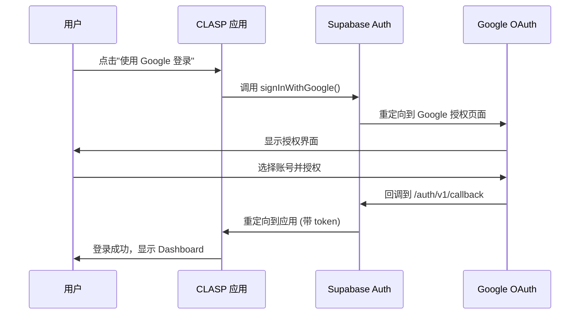
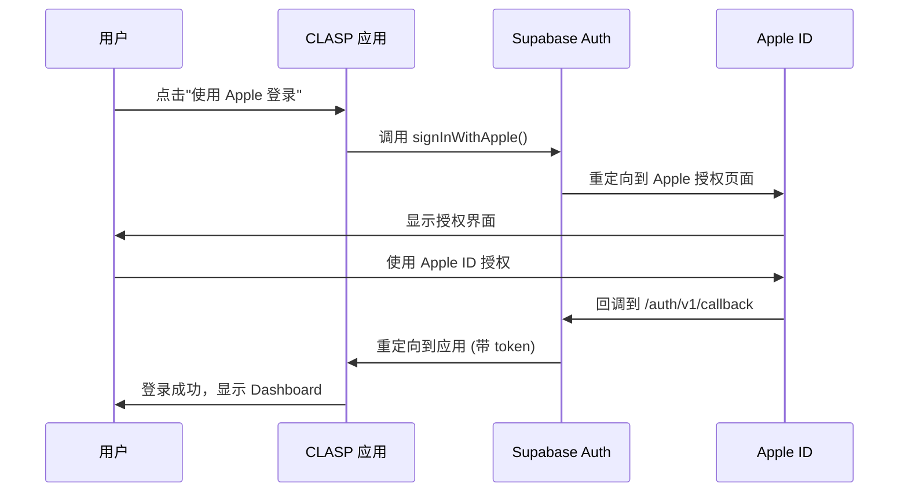
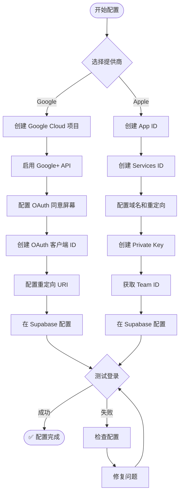

# OAuth 登录流程图

## 🔵 Google 登录流程



## 🍎 Apple 登录流程



## 🔄 配置关系图

### Google OAuth 配置关系

```
Google Cloud Console
├── OAuth 同意屏幕
│   ├── 应用名称: CLASP
│   ├── 授权域: your-domain.com
│   └── 测试用户: test@example.com
│
├── OAuth 客户端 ID
│   ├── Client ID ──────────┐
│   ├── Client Secret ──────┤
│   ├── JavaScript 来源     │
│   │   ├── http://localhost:3000
│   │   └── https://your-domain.com
│   └── 重定向 URI          │
│       └── https://xxx.supabase.co/auth/v1/callback
│                           │
└───────────────────────────┼──────────────────┐
                            │                  │
                            ▼                  ▼
                    Supabase Dashboard
                    └── Authentication
                        └── Providers
                            └── Google
                                ├── Client ID ◄──┘
                                └── Client Secret
```

### Apple OAuth 配置关系

```
Apple Developer Portal
├── App ID
│   ├── Bundle ID: com.yourcompany.clasp
│   └── Sign in with Apple: ✓
│
├── Services ID ────────────────────┐
│   ├── Identifier: com.yourcompany.clasp.web
│   ├── Domains: xxx.supabase.co   │
│   └── Return URLs:               │
│       └── https://xxx.supabase.co/auth/v1/callback
│                                   │
├── Private Key (.p8) ──────────────┤
│   ├── Key ID (10 位) ────────────┤
│   └── Private Key 内容 ──────────┤
│                                   │
└── Team ID (10 位) ────────────────┤
                                    │
                                    ▼
                            Supabase Dashboard
                            └── Authentication
                                └── Providers
                                    └── Apple
                                        ├── Services ID ◄──┘
                                        ├── Team ID
                                        ├── Key ID
                                        └── Private Key
```

## 🔐 认证流程详解

### 1. 用户点击登录按钮

```typescript
// 前端代码
const handleGoogleSignIn = async () => {
  const result = await signInWithGoogle();
  if ('url' in result) {
    window.location.href = result.url; // 重定向到 Google
  }
};
```

### 2. Supabase 生成授权 URL

```typescript
// lib/auth/actions.ts
export async function signInWithGoogle() {
  const supabase = await createClient();
  
  const { data, error } = await supabase.auth.signInWithOAuth({
    provider: 'google',
    options: {
      redirectTo: `${process.env.NEXT_PUBLIC_SITE_URL}/auth/callback`,
    },
  });
  
  return { url: data.url }; // Google 授权 URL
}
```

### 3. OAuth 提供商验证

```
Google/Apple 验证用户身份
├── 用户登录
├── 显示授权范围
└── 用户同意授权
```

### 4. 回调处理

```
Supabase 回调端点
├── 接收授权码
├── 交换访问令牌
├── 创建/更新用户记录
└── 生成 JWT token
```

### 5. 应用接收 token

```typescript
// app/auth/callback/route.ts
export async function GET(request: Request) {
  const { searchParams } = new URL(request.url);
  const code = searchParams.get('code');
  
  if (code) {
    const supabase = createClient();
    await supabase.auth.exchangeCodeForSession(code);
  }
  
  return NextResponse.redirect('/dashboard');
}
```

## 📊 配置检查流程



## 🎯 URL 配置对照表

| 环境 | 应用 URL | Supabase 回调 URL |
|------|---------|------------------|
| 本地开发 | `http://localhost:3000` | `https://xxx.supabase.co/auth/v1/callback` |
| 测试环境 | `https://test.your-domain.com` | `https://xxx.supabase.co/auth/v1/callback` |
| 生产环境 | `https://your-domain.com` | `https://xxx.supabase.co/auth/v1/callback` |

> 💡 **注意**: Supabase 回调 URL 在所有环境中都是相同的！

## 🔍 调试技巧

### 查看 OAuth 错误

1. **打开浏览器开发者工具**
2. **Network 标签页**
3. **查找重定向请求**
4. **检查 URL 参数中的 error 信息**

### 常见错误代码

| 错误代码 | 含义 | 解决方案 |
|---------|------|---------|
| `redirect_uri_mismatch` | 重定向 URI 不匹配 | 检查 OAuth 配置中的重定向 URI |
| `invalid_client` | 客户端 ID 无效 | 检查 Client ID/Services ID |
| `access_denied` | 用户拒绝授权 | 正常情况，用户取消了登录 |
| `invalid_request` | 请求参数错误 | 检查所有配置参数 |

## 📝 配置清单

### Google 登录配置清单

- [ ] Google Cloud 项目已创建
- [ ] Google+ API 已启用
- [ ] OAuth 同意屏幕已配置
  - [ ] 应用名称
  - [ ] 用户支持邮箱
  - [ ] 授权域
  - [ ] 测试用户（开发阶段）
- [ ] OAuth 客户端 ID 已创建
  - [ ] JavaScript 来源已添加
  - [ ] 重定向 URI 已配置
- [ ] Supabase Google Provider 已启用
  - [ ] Client ID 已填写
  - [ ] Client Secret 已填写
- [ ] 测试登录成功

### Apple 登录配置清单

- [ ] Apple Developer 账号已激活
- [ ] App ID 已创建
  - [ ] Bundle ID 已设置
  - [ ] Sign in with Apple 已启用
- [ ] Services ID 已创建
  - [ ] Identifier 已设置
  - [ ] 域名已配置
  - [ ] Return URLs 已配置
- [ ] Private Key 已创建
  - [ ] .p8 文件已下载
  - [ ] Key ID 已记录
- [ ] Team ID 已获取
- [ ] Supabase Apple Provider 已启用
  - [ ] Services ID 已填写
  - [ ] Team ID 已填写
  - [ ] Key ID 已填写
  - [ ] Private Key 已填写
- [ ] 测试登录成功

---

**配置完成后，记得重启开发服务器！** 🎉
